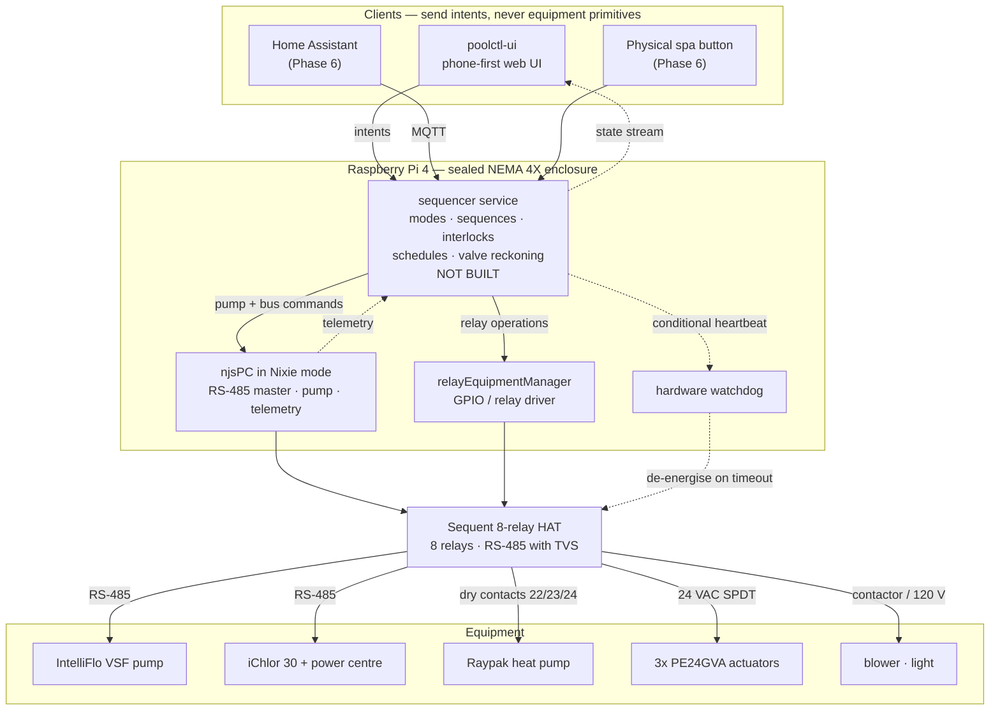

# Architecture

How the pieces fit, who owns what state, and what happens when each piece
dies. Companion to `poolctl-v1.md`, which carries the requirements and the
ADRs; this file is the system view.

> **Status:** the sequencer service described here does not exist yet. It is
> the keystone — nearly everything else is either built or bought. Sections
> below mark what is real today.

---

## The stack

---

## Components

| Component | Responsibility | Status |
|---|---|---|
| **poolctl-ui** | Renders state, sends intents (`setMode('spa')`). Holds no authority. | Built, on mock data |
| **sequencer** | Modes, the five sequences, all interlocks and invariants, schedules, valve dead-reckoning, targets, pump hold. The only writer. | **Not built** |
| **njsPC** | RS-485 master, pump control at 1 rpm resolution, chlorinator telemetry, MQTT/REST/WebSocket. | Not installed |
| **REM** | GPIO and relay I/O for the HAT. | Not installed |
| **watchdog** | De-energises every relay if the sequencer stops asserting health. | Not built |

The critical rule, from ADR-7 and reinforced by ADR-10: **exactly one process
commands equipment.** njsPC's own scheduler is disabled and dashPanel is a
diagnostic tool, not an operator interface — both can issue equipment commands
that bypass every interlock in this system.

---

## State ownership

Everything the client currently holds in `useController` is server state
wearing a disguise. This is where each piece belongs.

| State | Owner | Persisted | Notes |
|---|---|---|---|
| `mode`, `target`, sequence progress | sequencer | yes | survives client disconnect and restart |
| `valves.*` | sequencer | yes | dead-reckoned, no feedback; re-driven to pool on boot |
| `pumpHold` | sequencer | yes | a phone cannot be what remembers the pump is pinned |
| `targets.pool/spa` | sequencer | yes | cutoffs, clamped to `HEATER_CAP`; not heater setpoints (ADR-4) |
| schedules | sequencer | yes | ADR-11 |
| `heaterCall` | sequencer | yes | drives relays 4/5 |
| `pumpRpm`, watts | njsPC | no | telemetry off the bus |
| salt ppm, cell output | njsPC | no | telemetry, if ADR-6 lands on Path A |
| relay positions | REM | no | derived; sequencer holds intent |
| `waterTemp` | **undecided** | — | no sensor in the BOM — see open questions |
| tab, expanded rows, filters | client | no | genuinely client state |

---

## Control flow

**Intent path.** Client sends `setMode('spa')` over WebSocket. The sequencer
validates against current state, plans the sequence (applying skip conditions),
then walks it step by step — asserting the invariants before every command,
not just at the boundaries. Valve steps issue relay operations through REM;
pump steps go to njsPC. Each step advance streams back to every connected
client.

**Telemetry path.** njsPC publishes pump rpm, watts and cell readings. The
sequencer merges these with its own authoritative state and streams the union.
Clients never read njsPC directly — one source of truth, one shape.

**Rejection path.** An intent that would violate an invariant is refused with
a reason, and the reason is rendered. The UI already assumes this: the pump
slider's floor, the blower's gate, and the disabled-with-reason pattern all
expect the server to explain itself rather than silently clamp.

---

## Failure modes

| Failure | Detected by | Response |
|---|---|---|
| Sequencer dies or wedges | watchdog stops being fed | all relays de-energise to fail-safe |
| njsPC dies | sequencer's calls fail | sequencer drives relays to fail-safe via REM; stops feeding the watchdog if it cannot |
| REM dies | sequencer's relay ops fail | sequencer refuses transitions, stops feeding the watchdog |
| Pi loses power | — | relays de-energise: valves to pool, bypass to flow, heater open, blower off |
| Client loses network | client's own staleness timer | nothing happens to equipment — the entire point of ADR-7 |
| Valve position drifts | nothing; there is no feedback | re-driven to pool on every boot |
| RS-485 corruption | checksum failures, visible in the bus monitor | njsPC retries; persistent failures are a wiring or termination fault |

The fail-safe direction is fixed in hardware by NO/NC selection, not in
software: **valves to pool, bypass to flow, heater contacts open, blower off.**
A heater with flow and no call is harmless; a call with no flow is not.

---

## What exists today

Built: the client UI in full — water path, mode transitions, heat targets,
pump speed and schedules, the RS-485 bus monitor — all against
`useController` and `useBus`, which are mocks.

`src/lib/sequences.js` is the executable spec: five named sequences, declarative
skip conditions, and the invariant list. **The sequencer service must implement
exactly this file.** If the two disagree, one of them is a bug.

Not built: the sequencer, the transport, and real connection state — the client's
`connected` flag is currently hardcoded `true` and nothing ever clears it.

Not installed: njsPC, REM, Node itself. Deliberate — njsPC in Nixie mode wants
its serial port and relay configuration, which arrive with the HAT.
