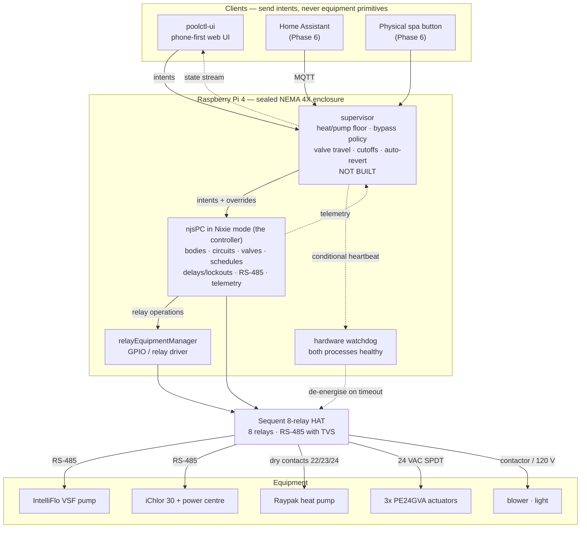

# Architecture

How the pieces fit, who owns what state, and what happens when each piece
dies. Companion to `poolctl-v1.md`, which carries the requirements and the
ADRs; this file is the system view.

> **Status:** revised August 2026 after reading njsPC's source. The earlier
> draft described a sequencer that owned everything; njsPC turned out to
> already implement most of it. The supervisor described here does not exist
> yet. Sections below mark what is real today.

---

## The stack

---

## Components

| Component | Responsibility | Status |
|---|---|---|
| **poolctl-ui** | Renders state, sends intents (`setMode('spa')`). Holds no authority. | Built, on mock data |
| **njsPC (Nixie)** | The controller. Bodies, circuits, valves, pumps, schedules, and the delay/interlock manager in `Lockouts.ts`. RS-485 master, chlorinator telemetry, MQTT/REST/WebSocket. | Not installed |
| **supervisor** | Only the six interlocks njsPC lacks — heat-conditional pump floor, bypass policy, PE24GVA travel, targets-as-cutoffs, conditional purge, spa auto-revert. The only external writer. | **Not built** |
| **REM** | GPIO and relay I/O for the HAT. | Not installed |
| **watchdog** | De-energises every relay unless njsPC and the supervisor are both healthy. | Not built |

**njsPC is not a bus library and cannot be treated as one.** Nixie mode is a
full controller: `HeaterCooldownDelay` drives circuits from its own timer,
`PumpValveDelay` gates pump starts, `ManualPriorityDelay` overrides schedules.
Anything layered on top configures and supervises it — see ADR-10, which was
revised after reading the source, and preserves the wrong first draft as a
lesson.

The rule from ADR-7 still holds: **exactly one thing decides what a device
does.** Here that is njsPC, with the supervisor holding the interlocks njsPC
has no concept of. dashPanel remains a diagnostic tool, not an operator
interface — it commands equipment directly, bypassing anything the supervisor
adds.

---

## State ownership

Everything the client currently holds in `useController` is server state
wearing a disguise. This is where each piece belongs.

| State | Owner | Notes |
|---|---|---|
| `mode` (pool/spa) | njsPC bodies/circuits | *pending* — depends on whether `sys.equipment.shared` fits this plumbing |
| sequence progress | supervisor | the step list the UI renders |
| `valves.*` position | njsPC `ValveState.isDiverted` | boolean only |
| valve travel timing and ordering | supervisor | 45 s, one at a time; njsPC has no travel model |
| `pumpHold` | njsPC `ManualPriorityDelay` | already carries an `endTime` — ADR-11 |
| schedules | njsPC | ADR-11 |
| `targets.pool/spa` | supervisor | cutoffs clamped to `HEATER_CAP`; njsPC assumes it owns setpoints (ADR-4) |
| `heaterCall` | njsPC heaters | supervisor enforces the pump floor and bypass around it |
| bypass position | supervisor | njsPC has no bypass concept (ADR-9) |
| `pumpRpm`, watts | njsPC | telemetry off the bus |
| salt ppm, cell output | njsPC | telemetry, if ADR-6 lands on Path A |
| relay positions | REM | driven by njsPC |
| `waterTemp` | **undecided** | no sensor in the BOM — see open questions |
| tab, expanded rows, filters | client | genuinely client state |

---

## Control flow

**Intent path.** Client sends `setMode('spa')` to the supervisor. The
supervisor checks its six interlocks, then asks njsPC to switch bodies — njsPC
runs its own cooldown and valve delays and drives REM. The supervisor watches
the resulting state and holds the extra rules around it: the pump floor while
heat is called, the bypass position, the travel interlock between valve moves.

**Telemetry path.** njsPC publishes pump rpm, watts and cell readings. The
supervisor merges these with the state it owns and streams the union. Clients
never read njsPC directly — one source of truth, one shape.

**Rejection path.** An intent that would violate an invariant is refused with
a reason, and the reason is rendered. The UI already assumes this: the pump
slider's floor, the blower's gate, and the disabled-with-reason pattern all
expect the server to explain itself rather than silently clamp.

---

## Failure modes

| Failure | Detected by | Response |
|---|---|---|
| Supervisor dies or wedges | watchdog stops being fed | all relays de-energise to fail-safe |
| njsPC dies or wedges | supervisor's calls fail; watchdog stops being fed | all relays de-energise to fail-safe |
| REM dies | njsPC relay ops fail | supervisor refuses transitions, stops feeding the watchdog |
| Pi loses power | — | relays de-energise: valves to pool, bypass to flow, heater open, blower off |
| Client loses network | client's own staleness timer | nothing happens to equipment — the entire point of ADR-7 |
| Valve position drifts | nothing; there is no feedback | re-driven to pool on every boot |
| Valve de-energises mid-hold | nothing yet | open question — REM `latch` semantics against a PE24GVA SPDT selector |
| RS-485 corruption | checksum failures, visible in the bus monitor | njsPC retries; persistent failures are a wiring or termination fault |

The fail-safe direction is fixed in hardware by NO/NC selection, not in
software: **valves to pool, bypass to flow, heater contacts open, blower off.**
A heater with flow and no call is harmless; a call with no flow is not.

---

## What exists today

Built: the client UI in full — water path, mode transitions, heat targets,
pump speed and schedules, the RS-485 bus monitor — all against
`useController` and `useBus`, which are mocks.

`src/lib/sequences.js` is the executable spec: five named sequences, declarative
skip conditions, and the invariant list. **It needs re-reading against njsPC's
body and circuit model** — some of its steps are likely njsPC configuration
rather than code anyone writes. What survives that pass is the supervisor's
job.

Not built: the supervisor, the transport, and real connection state — the
client's `connected` flag is hardcoded `true` and nothing ever clears it.

Not installed: njsPC, REM, Node itself. Deliberate — njsPC in Nixie mode wants
its serial port and relay configuration, which arrive with the HAT.
