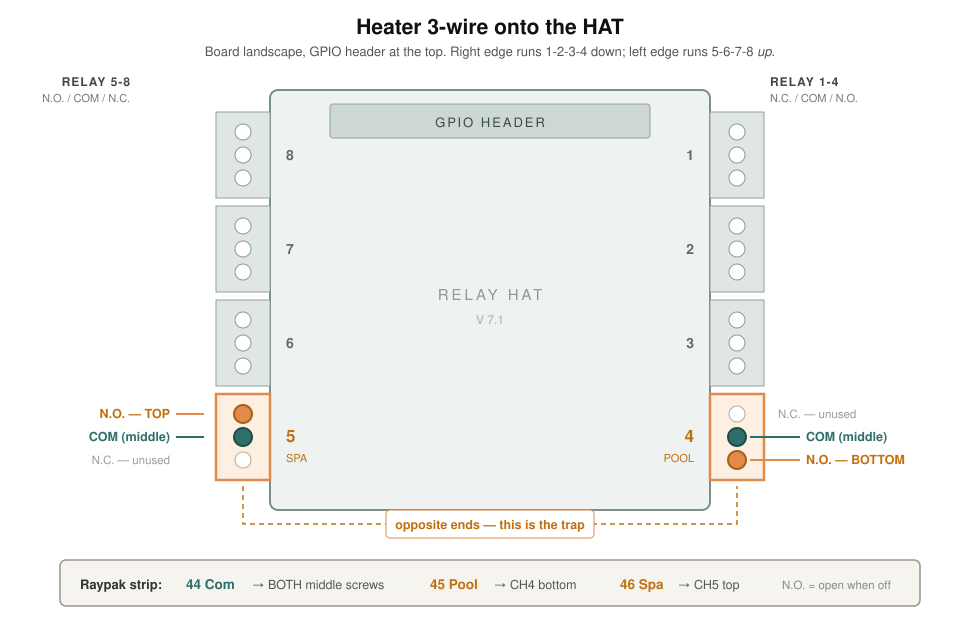

# Wiring the heater — field procedure

Phase 3: the Raypak's 3-wire control onto CH4 and CH5. Valves stay manual;
the pump is untouched. This is the smallest change in the project with the
largest payoff, and it is the first time this panel drives real equipment.

Companion to `docs/bench-relays.md`, which is the bench work this rests on.
Everything about which screw is which was measured on 28 August 2026 — see
Test 1b there if you want to re-derive it rather than trust it.

---

## Before leaving the bench

- [ ] The card is labelled 1–8 in marker. If it is not, do Test 1b first.
      Nothing below is safe to follow from position alone.
- [ ] `git log` on the Pi matches what you think is deployed —
      `PI=<user>@poolctl.local ./scripts/deploy.sh` if unsure.
- [ ] The end-to-end call works. **Done 28 August 2026**: tapping *Heat the
      pool* produced `relays -> 0x10  REL4`, with CH3 releasing at the same
      moment. If that ever stops being true, fix it here, not at the pad.

Take: the meter, a phone on the pool wifi, the Raypak I&O manual, and this
page. The board map is reproduced at the bottom.

---

## 1. Everything off, and prove it

The heater has its own supply. Kill it at the breaker and **confirm dead with
the meter** — the terminal strip is low voltage but it is not de-energised
just because the display is dark.

Also power down the panel. There is no reason to land a wire on a live card,
and the relays latch, so "the supervisor says it is off" is not the same
statement as "the contact is open".

---

## 2. Find terminals 44, 45, 46

Per ADR-4 these are **COMMON / POOL / SPA** on the Raypak's low-voltage
terminal strip, inside the cabinet. From the HPPH Installation & Operation
manual, p.47:

> **3-Wire Controllers.** Install wires from the automation controller for
> "Heat" on the terminal strip inside the HPPH on the terminals: # 44(Com),
> # 45 (Pool) & # 46 (Spa).

**This ADR said 22/23/24 until 30 August 2026 and those numbers were wrong.**

**Confirmed on the equipment, 30 August 2026.** The strip is real and the
legend beside it brackets **44 / 45 / 46 as `REMOTE`** — with 42/43 as the
3-way valve above it, 47/48 as `AUX SENSOR` below, and 49 `NOT USED`. So the
manual's numbers and this unit's silkscreen agree.

One thing the manual does not mention: a factory harness already runs from
those strip positions to a **5-pin `REMOTE` header** on the control board.
That harness is the internal path from the field strip to the board — leave
it connected. The strip is the field interface, so field wires land on the
**opposite side of the same positions**, not in place of the harness.

**What you are looking for** is neither circuit board. Manual Fig. 16,
*Heater Wiring Block*, photographs it: a beige barrier strip screwed to the
chassis, two screws per row, with **40–49 printed on the panel beside it**
rather than on the strip. The numbers are bracketed into groups:

| Terminals | Panel label |
|---|---|
| 41–43 | 3-WAY VALVE |
| **44–46** | **REMOTE** |
| 47–48 | AUX SENSOR |

It sits low in the control box near where the existing field wiring enters,
and it will already have wires on it. Hunt for the printed numbers, not for
the block.

Do not confuse it with the small board carrying `P1` and `P2` screw terminals
under an `RS-485` legend with green/yellow pairs — that is a separate comms
board and has nothing to do with the heat call.

Two things that were open questions here are now answered, and both are
required before a contact does anything:

- **Remote mode must be enabled at the keypad.** Hold UP and DOWN together
  for 3+ seconds. The top line then reads `Remote`, and a live call shows as
  `Remote Pool <setpoint>F` or `Remote Spa <setpoint>F`. Exiting remote
  **defaults the board to OFF** — so if the heater ever stops responding
  after someone touches the keypad, check this first.
- **The INSTALLER menu has a `Remote Pool` setting**, and its factory default
  is **Cool**. The manual's 3-wire procedure says to set it to `Heat` or
  `Auto`. Record what it was before you change it.

While the door is open, also write down:

- **The heater's own POOL and SPA setpoints, and POOL MAX TEMP / SPA MAX
  TEMP.** These are the real thermostat. ADR-4 exists so the caps live in
  firmware rather than in this repository, and in remote mode it is those two
  MAX values that bind.
- **Which terminals the outgoing IntelliConnect pair lands on.** If it is
  44/46, that install has been heating at the *spa* setpoint every time it
  called — see ADR-4.
- **The run length from the panel to this strip**, which is not recorded
  anywhere and which you need before buying cable.

If the terminals are not 44/45/46, **stop and update ADR-4** rather than
adapting on the fly. The whole safety argument names those terminals.

### Do not wire to the board's REMOTE header

The main control board (Raypak `H000302`; silkscreen `1204-100`,
`47-103748-02`, `HSCI 1204-83-102A`) carries a 5-pin header marked **REMOTE**
along its top edge, between `EXV` and `POWER`. That is the factory link from
the board to the numbered terminal strip. Field wiring goes on the **strip**,
not on that header — the manual is explicit that the automation controller
lands on "the terminal strip inside the HPPH".

This is also why no harness kit exists for these units. The illustrated parts
list for models 5450/6450/8450 (Raypak catalogue 9100.74) lists every control
box part — board, display, transformer, contactor, relays, sensors — and
contains **no remote harness of any kind**, because the strip is already
there and takes bare conductors. Harness kits like `080349F` are for the Avia
**gas** heaters, a different product line with a different control box.

**If there is no numbered strip in your cabinet**, stop. That would mean the
REMOTE header is the only connection point, the DIY cable plan is wrong, and
the right next step is Raypak service on 800-260-2758 with the board numbers
above — not improvising a connector.

---

## 2b. Prove the two calls before wiring anything

Ten minutes, no panel involved, and it is the difference between believing
the 3-wire model works on this unit and knowing it.

With the heater in Remote and its supply **off at the breaker**:

1. Jumper **44 – 45**. Restore power. The display should read
   `Remote Pool <setpoint>F`.
2. Kill power. Move the jumper to **44 – 46**. Restore power. It should read
   `Remote Spa <setpoint>F`.

Two distinct calls, each showing the heater's own setpoint, is ADR-4
confirmed end to end. If only one of them lands, stop — spa heating to a spa
temperature is then not available through contacts, and that is a design
change rather than a wiring problem.

Remove the jumper before going any further.

### Done, 30 August 2026 — both calls land

Bridged at the panel end, on the HAT's pluggable blocks with the blocks off
the card, so no relay was involved. Both calls landed and both released
cleanly when the jumper came off.

| conductor | heater terminal | call | channel |
|---|---|---|---|
| **green** | 45 | `Remote Pool` | CH4 |
| **red** | 46 | `Remote Spa` | CH5 |

Common on 44 is pigtailed under a wire nut into two conductors, one to the
middle screw of each block — 44 is the return for both calls, so it has to
reach two channels from one cable core.

**Green carries the pool call and that is against this project's own
convention** — green means bonding, and this panel has a PE bar. It was
already terminated at both ends when the mapping was established, and
re-pulling it buys nothing electrically on a Class 2 dry circuit. Left as
built, recorded here, and the conductors are labelled `44`/`45`/`46` at both
ends so the colour is not what anyone reads.

**What the heater reported.** Pool call, with the pump at 1800 rpm and the
bypass turned to the heater by hand:

```
Remote Pool heating
Remote Pool 86F
```

- **Pool setpoint is 86 °F.** ADR-4 carried this as unknown from the day it
  was written. Water was 80 °F, so the call was real rather than nominal.
- **It ran at 1800 rpm with no flow fault.** `HEATER_MIN_RPM` is 1900 and has
  never been measured. This is the first evidence against it — but it proves
  only that the heater's own flow switch is satisfied at 1800 with the bypass
  open. It does **not** show the nameplate's 30–60 GPM is met. Do not lower
  the constant on the strength of one absent fault; that needs a flow reading.
The spa call was then bridged the same way and reported:

```
Remote SPA heating
Remote SPA 86F
```

**Both calls report 86 °F, and the manual explains why.** There are two
independent setpoints and the contact selects between them:

> The control uses the appropriate Pool or Spa setpoint as selected in the
> Operating mode.

> When POOL HEAT mode is selected, each press of the UP or DOWN buttons will
> increase / decrease the pool heating setpoint temperature. […] When SPA mode
> is selected, each press of the UP or DOWN buttons will increase / decrease
> the spa setpoint temperature.

So ADR-4 holds as written. They read alike because this heater had never been
under remote control before today and nobody had ever set the spa one.

**Raising the spa setpoint is a commissioning step, and it cannot be done
from Remote.** *"If the UP, DOWN or MENU buttons are pressed while in REMOTE
mode, the display will read 'Exit Remote Mode to Adjust Temp'. Mode and
temperature setpoints are not changed."* The sequence is: exit Remote, select
SPA mode, UP/DOWN to the wanted temperature, re-enter Remote. Exiting Remote
drops the control to OFF, so re-entering is not optional.

Until that is done, a spa call heats to 86 °F, which is a pool temperature.

**Done, 30 August 2026.** Set at the keypad to **pool 90 °F, spa 100 °F** —
both inside the caps, and now distinguishable, so the two calls can be told
apart by their number rather than only by the word on the top line:

| call | expected display |
|---|---|
| common → 45 | `Remote Pool 90F` |
| common → 46 | `Remote Spa 100F` |

That is a better confirmation of the two-setpoint model than the manual
quote above, because it is this unit answering rather than a document.

**The caps, confirmed with their ranges** (User Menu, Table C):

| | range | default |
|---|---|---|
| Pool Max Temp | 65–95 °F | 95 °F |
| Spa Max Temp | 65–104 °F | 104 °F |

95 and 104 are the **top of the adjustable range**, not defaults that can be
raised — which is the exact claim ADR-4's safety argument rests on, now
quoted rather than assumed.

**The manual states our hazard outright**, which is worth having in the
record beside ADR-9:

> **WARNING:** If the Spa heating (in a pool/spa system) is controlled by an
> external controller, 3-way valves MAY need to be manually adjusted in order
> to use the TIMED SPA feature of this HPPH. Failure to properly adjust the
> 3-way valves may result in **overheating of the pool water** or other
> undesirable results.

The call selects a setpoint, not a body — the plumbing decides which water
gets heated. That is why the supervisor ties the spa heat call to spa mode
rather than exposing it as a switch of its own.

**Read the display, not the compressor.** The first bridge tried to start the
heater and the anti-short-cycle delay then masked the second, so the top line
is the result. `Remote Off` → `Remote Pool <setpoint>F` → `Remote Off` is the
whole test.

---

## 3. Keep the heater's voltage away from the transformer

CH4 and CH5 carry **the Raypak's own low voltage**, supplied on its terminal
strip. They must not share anything with the panel's 24 VAC actuator supply —
no shared common, no shared bus.

This is the one wiring mistake here that damages equipment rather than merely
misbehaving. Two sources tied together through a relay common is a fault
looking for a path.

---

## 4. Land the wires

Three conductors, and the two ends are not symmetrical — so name them before
you strip anything:

| conductor | heater end | panel end |
|---|---|---|
| Com | terminal **44** | COM screw on **both** CH4 and CH5 |
| Pool | terminal **45** | CH4, **N.O.** |
| Spa | terminal **46** | CH5, **N.O.** |

Terminal 44 lands on two screws — it is the common return for both calls.



Both channels sit at the **bottom** of the card on **opposite edges** — the
right edge runs 1-2-3-4 downward, the left edge runs 5-6-7-8 *upward*. Drawn
from Test 1b in `bench-relays.md`, measured 28 August 2026.

**COM to the middle screw on both.** Then:

| | relay | block | screw | contact |
|---|---|---|---|---|
| Pool heat | 4 | right edge, 4th from top | **bottom** | N.O. |
| Spa heat | 5 | left edge, bottom | **top** | N.O. |

> **CH4/CH5 is a hold, not a conclusion.** The two channels are on opposite
> edges of the card, so a single jacketed cable cannot reach both without
> fanning conductors across it — past the 24 VAC channels the heater pair is
> supposed to stay clear of. Moving the heater to CH5+CH6 fixes that, and is
> tracked in
> [#1](https://github.com/j4rs/poolctl/issues/1). It is deliberately **not**
> being done before the first test: a bench rig uses loose leads that reach
> either edge, and renumbering costs the same tomorrow as today. Do it before
> wire goes in a gland.

**The pair does not wire symmetrically.** CH4 and CH5 straddle the boundary
between the board's two connector groups, which are mirrored — so the same
job takes opposite screws. This is the easiest mistake available on this card
and it fails in the worst direction: wire them alike and one contact sits
closed while the supervisor believes the heater is idle. A heat call nobody
made, that nothing in software can see.

Both are **N.O.**, so no call exists when the coil is de-energised. That is
the fail-safe: `0x00` means every contact open.

**Verify with the meter before energising anything.** Card unpowered, probe
COM to the wire you just landed on each channel: both should read open. If
either beeps, it is on N.C. and must move.

---

## 5. Power up and test

> ### ⚠︎ Turn the bypass to flow by hand, first
>
> **The bypass interlock does not exist yet in this phase.** The valve
> actuators are not wired until Phase 4, so the supervisor drives CH3, updates
> `valves.bypass`, and believes the exchanger has flow — while the physical
> diverter sits wherever a human last left it. It has no sensor on that valve
> and never has; the position is dead-reckoned from what it commanded.
>
> So `heaterCall !== 'off' ⟹ valves.bypass === 'flow'` holds perfectly in
> `invariants.js` and means nothing at the pad. Nothing in software will stop
> a heat call into a bypassed exchanger today, and nothing will report one.
>
> The bypass is binary — full flow or full bypass — so *around* with a call
> standing is **zero** water through the heater, pump running or not. The
> heater's water pressure switch is the only protection left, and ADR-5 is
> explicit that it is a backstop rather than a control.
>
> **Before any call, including a hand-bridged one: turn the diverter to send
> flow through the heater, and confirm it by hand.** You are the interlock
> until Phase 4. Found the hard way on 30 August 2026 — pump running, bypass
> around, contact bridged, heater attempting to start.

Panel first, heater second. Watch the journal:

```bash
ssh <user>@poolctl.local 'journalctl -u poolctl -f'
```

Expect `relays -> 0x00 (all off) — boot`, then `relays -> 0x40  REL3` once
njsPC answers.

### Pool heat

**Done, 30 August 2026 at 11:36:35 — the first equipment this system has
ever controlled.**

```
Aug 30 11:36:35 poolctl node[1035]: relays -> 0x10  REL4
```

The heater turned on. Conditions: pump at 1800 rpm, bypass turned to the
heater by hand, water 86 °F against a 90 °F setpoint.

**One byte carries both halves.** The resting state was `0x40` — REL3, bypass
around. The call is `0x10` — REL4 alone. So REL3 released and REL4 closed in
a single write, which means there is no instant at which a heat call exists
while the bypass is still commanded around. The interlock is not enforced by
ordering the writes correctly; the bad combination cannot be observed at all.
That is the whole reason `relays.js` writes the byte outright instead of
read-modify-write, and it is the first time it has mattered on real
equipment.

Before this, the wiring had already proved itself: with the panel powered and
nothing tapped, the heater read `Remote Off`. Relays de-energised, both
contacts open, call wires confirmed on N.O. by the whole circuit rather than
by a meter on one screw pair.

**The release, and the purge — also first-run on real equipment:**

```
Aug 30 11:39:58 poolctl node[1035]: relays -> 0x00  (all off)
Aug 30 11:43:01 poolctl node[1035]: purge elapsed — bypass around the heater
Aug 30 11:43:01 poolctl node[1035]: relays -> 0x40  REL3
```

Ending the call gives `0x00`, not `0x40`, and that is the purge. REL3
de-energised is *flow*, so the supervisor is deliberately holding water
through the exchanger rather than isolating it — `bypassHeld()` overriding
the position back to flow while `purgeHolding` is set. Only once the purge
elapses does the bypass go to around and the byte return to `0x40`.

So the whole cycle, observed: `0x40` idle → `0x10` call → `0x00` purge →
`0x40` idle.

**Measured: the hold was 3 m 03 s against a configured 3 m 00 s.** The three
seconds are the evaluation interval — `evaluate()` runs on the 5 s heartbeat,
so it can only notice the purge has elapsed at the next beat. Late by design,
and late in the direction that keeps flow on longer rather than shorter.

**What this does not measure is whether three minutes is right.**
`PURGE_MIN` is an invented number and remains one. What is now verified is
that the mechanism runs, holds for its configured duration, and releases —
not that the duration matches the Raypak's actual compressor-idle time. That
still needs measuring, and PRD §10 still carries it.

1. Tap **Heat the pool**, confirm twice (`useConfirm` arms on the first tap).
2. Journal should show `relays -> 0x10  REL4`.
3. **CH3 goes off and CH4 comes on, together.** CH3 releasing is the bypass
   swinging to *flow through the heater* — de-energised is flow, which is why
   a heat call releases relay 3 rather than driving it.
4. The heater should acknowledge a call. It will not necessarily start: the
   anti-short-cycle delay is 5–8 minutes, and there is no flow yet because
   the pump is not on this panel until Phase 4.
5. Tap again to stop. Journal returns to `relays -> 0x40  REL3`.

### Spa heat

Spa heat is implied by spa mode, not by a separate control — the supervisor
owns both contacts, and entering spa mode asserts CH5. Hold **Spa** for five
seconds and expect `relays -> 0x05` plus CH5. Valves are still manual, so
this is a contact test only.

### What to record

- Time from tap to contact close (should be immediate — `publish()` drives
  the relays, not the 5 s heartbeat).
- Whether the heater's display acknowledges the call, and how.
- **Time the anti-short-cycle delay.** The manual gives two figures — 5
  minutes in one place, 6–8 in another. `PURGE_SKIP_AFTER_MIN` is 5, the
  optimistic reading. This is a real number the project currently guesses at.

---

## Pump: disabling priming, and changing speed live

Two things about the IntelliFlo VSF that this project asserted without a
source until 30 August 2026. Both quoted from the *IntelliFlo VSF Variable
Speed and Flow Pump Installation and User's Guide*, p.19.

**Speed can be changed while the pump runs, from the pump's own keypad.**

> **Adjusting and Saving a Pump Speed/Flow** — 1. While the pump is running,
> press the Up or Down arrow to adjust to desired speed or flow setting.

The Pentair *app* requires stopping a program to edit its speed; the pump
does not. That matters for any flow test — a ramp done at the keypad costs no
pump restart, so no priming burst and no heater anti-short-cycle wait between
steps.

**Disabling priming must be done at the pump, and the automation cable comes
off while you do it.**

> When the IntelliFlo VSF […] is connected to an automation control system
> […] the priming feature on the pump cannot be disabled by the external
> automation control system only. It must also be disabled on the pump
> itself.

Procedure with automation connected:

1. Disable the priming feature on the automation control system.
2. **Temporarily disconnect the RS-485 communication cable.**
3. Open the control panel lid. Press **Menu**, arrows to **Priming**, select
   **Disabled**, press **Back**.
4. Reinstall the RS-485 cable.

Standalone the path is `Menu → Down to "Priming" → Select → "Disabled" →
Select → Save → Back`.

And the sentence ADR-9 rests on, which was previously paraphrased from
nowhere in particular:

> If priming is enabled on start up, the pump responds to its internal
> settings **before** responding to commands from an automation control
> system.

---

## Stop conditions

**Both heat contacts closed at once.** Should be impossible — `byteFor` sets
one or the other from a single `heaterCall` value — but if the meter says
otherwise, stop. That is a wiring fault or a relay fault, and it means the
heater is being told two things.

**A contact closed with the supervisor reporting idle.** Almost certainly
N.C./N.O. reversed. Check `curl http://127.0.0.1:4300/health` for
`thinking:true` first — a supervisor that has stopped evaluating still serves
and still looks alive.

**`FLo` or `FL3` on the heater.** Low flow. Expected here, since no pump is
running, but do not leave a call standing against it.

---

## Board map

Landscape, GPIO header along the top, screws vertical in each block.

```
                      top
   +-----------------------------------+
 8 |                                   | 1
 7 |          header, DIP              | 2
 6 |                                   | 3
 5 |                                   | 4
   +-----------------------------------+
```

Right edge runs 1-2-3-4 top to bottom. Left edge runs 5-6-7-8 **bottom to
top**. Contact order: `RELAY 1-4` is N.C./COM/N.O. top to bottom, `RELAY 5-8`
is N.O./COM/N.C. COM is the middle screw on all eight.

---

## What this does not cover

The valves. CH1–CH3 are Phase 4, and one rule there is not implemented yet:
*no valve command while another valve move is in flight*. It describes a
transition, cannot be seen in a state snapshot, and belongs with valve
driving. Do not land actuator wires on the assumption that it is enforced.
